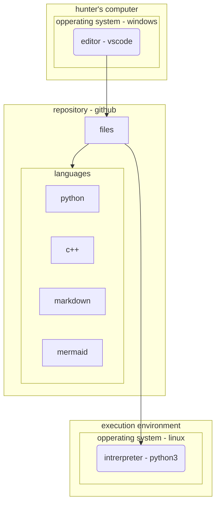

# helloworld
a simple example

----

```mermaid
flowchart TB

subgraph hunter's computer
subgraph opperating system - windows
ed(editor - vscode)
end
end

subgraph languages
python
c++
markdown
mermaid
end

subgraph repository - github
files-->languages
end

subgraph execution environment
subgraph opperating system - linux
int(intrerpreter - python3)
end
end

ed-->files
files--->int
```
